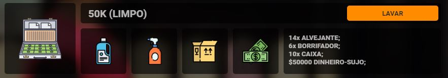
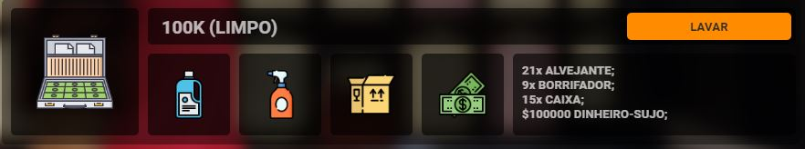
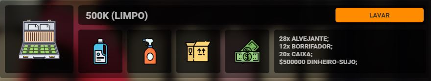
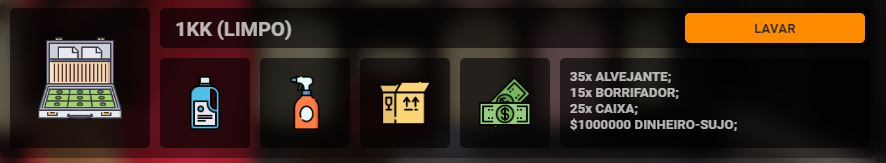

<!DOCTYPE html>
<html lang="en">
<head>
<meta charset="UTF-8">
<meta name="viewport" content="width=device-width, initial-scale=1.0">
<meta http-equiv="X-UA-Compatible" content="ie=edge">
<meta name="Description" content="Enter your description here"/>
<link rel="stylesheet" href="https://cdnjs.cloudflare.com/ajax/libs/twitter-bootstrap/4.5.0/css/bootstrap.min.css">
<link rel="stylesheet" href="https://cdnjs.cloudflare.com/ajax/libs/font-awesome/5.14.0/css/all.min.css">
<link rel="stylesheet" href="assets/css/style.css">

</head>
<body>
 
  

   
   
<h1>NativeUI (NAV) | Money Wash</h1>

   
</img>

   
</img>

   
</img>

   
</img>

   
</img>

   
   
    
  

  
</body>
</html>
